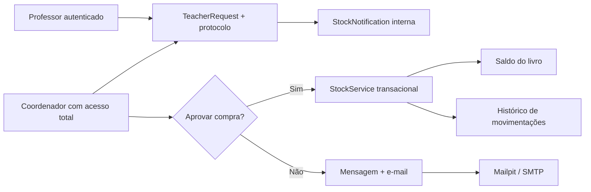
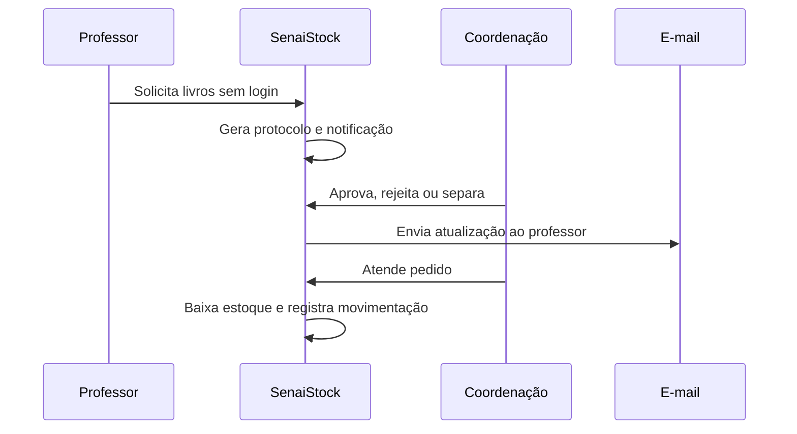

# SenaiStock


SenaiStock é uma aplicação Laravel para controle profissional do estoque de livros didáticos do SENAI-SP. O sistema centraliza cadastro de livros, entradas, saídas, solicitações públicas de professores, alertas de estoque baixo, compras e histórico operacional.

## Problema Resolvido

Unidades com alto volume de turmas precisam saber o saldo real de livros no estoque. Sem controle transacional, materiais podem faltar em momentos críticos. O SenaiStock reduz esse risco com baixa validada, protocolos de solicitação, indicadores de estoque mínimo e rastreabilidade das movimentações.

## Stack

| Camada | Tecnologia |
|---|---|
| Backend | Laravel 13, PHP 8.3+ |
| Frontend | Blade, Tailwind CSS, Alpine.js, Vite |
| Banco | MySQL em produção/local, SQLite em testes |
| Autenticação | Laravel Breeze + sessão interna de funcionário |
| E-mail | Mailpit recomendado em local, mailer configurável no `.env` |
| Testes | PHPUnit 12, Feature e Unit tests |

## Funcionalidades

- Cadastro de livros com ISBN, disciplina, descrição, saldo, estoque mínimo, localização e status.
- Entrada de estoque com incremento automático e histórico de movimentação.
- Saída de estoque com transação, lock de linha e bloqueio de estoque negativo.
- Dashboard com indicadores, acervo, alertas, compras, fornecedores, turmas e equipe.
- Aprovação, rejeição, separação, atendimento e mensagens personalizadas da coordenação.
- Notificações internas e e-mails automáticos para professores.
- Testes automatizados cobrindo APIs, CRUDs, estoque e fluxo professor-coordenação.

## Arquitetura



## Estrutura Principal

```text
app/
  Http/Controllers/
    SenaiStockController.php
  Mail/
    TeacherRequestStatusMail.php
  Models/
    Book.php
    Movement.php
    TeacherRequest.php
    TeacherRequestMessage.php
    StockNotification.php
  Services/
    StockService.php
    TeacherRequestService.php
database/
  migrations/
  seeders/
resources/
  views/
    auth/employee-login.blade.php
    teacher-requests/
    senai-stock/index.blade.php
tests/
```

## Fluxo de Uso



## Instalação

```bash
composer install
npm install
cp .env.example .env
php artisan key:generate
php artisan migrate --seed
npm run build
php artisan serve
```

Em Laragon neste ambiente, o PHP usado para validação foi:

```powershell
C:\laragon\bin\php\php-8.3.30-Win32-vs16-x64\php.exe artisan test
```

## Variáveis Importantes

```env
APP_NAME=SenaiStock
APP_URL=http://127.0.0.1:8000
DB_CONNECTION=mysql
DB_DATABASE=senaiStk
MAIL_MAILER=smtp
MAIL_HOST=127.0.0.1
MAIL_PORT=1025
MAIL_FROM_ADDRESS=coordenacao@senai.local
QUEUE_CONNECTION=sync
```

Para Mailpit local, use `MAIL_HOST=127.0.0.1` e `MAIL_PORT=1025`.

## Usuários de Demonstração

Após `php artisan db:seed`:

| Perfil | NIF | CPF |
|---|---:|---|
| Administrador | 111111 | 11111111111 |
| Usuário demo | 654321 | 98765432100 |

## Comandos Úteis

```bash
php artisan migrate --seed
php artisan test
php artisan route:list
npm run dev
npm run build
php artisan config:clear
```

## Regras de Negócio

- Saídas não podem superar o saldo disponível.
- Toda entrada ou saída gera registro em `movements`.
- Solicitações públicas sempre geram protocolo `SS-YYYYMMDD-XXXXX`.
- Solicitações podem passar por `pendente`, `aprovado`, `separado`, `atendido`, `rejeitado` ou `compra`.
- Pedidos aprovados, rejeitados ou separados podem enviar e-mail ao professor.
- Estoque crítico é calculado por `minimum_stock`, com fallback em `config/senaistock.php`.

## Segurança e Produção

- `.env`, logs, cache, uploads privados e dependências locais ficam fora do versionamento.
- Rotas internas usam middleware de sessão `employee.auth`.
- Rotas públicas têm rate limit para reduzir abuso.
- Validações ficam nos controllers e regras transacionais nos services.
- Para produção, configure HTTPS, SMTP real, backup de banco, filas persistentes e usuários reais com política formal de acesso.

## Mockups de Tela

- Login interno: visual minimalista SENAI-SP, card de acesso rápido e atalho para professor.
- Solicitação pública: formulário responsivo sem login, protocolo e histórico de comunicação.
- Painel: sidebar por grupos, indicadores, alertas, pedidos, acervo e movimentações.

## Roadmap

- Permissões granulares entre Coordenador e Professor.
- Exportação PDF/Excel de relatórios.
- Painel dedicado de auditoria e logs de acesso.
- Integração com cadastro institucional de turmas/professores.
- Jobs assíncronos para e-mail e notificações recorrentes.
- Deploy com CI/CD, backups automáticos e observabilidade.

## Licença

Este projeto usa licença proprietária comercial. Consulte [LICENSE](LICENSE).
